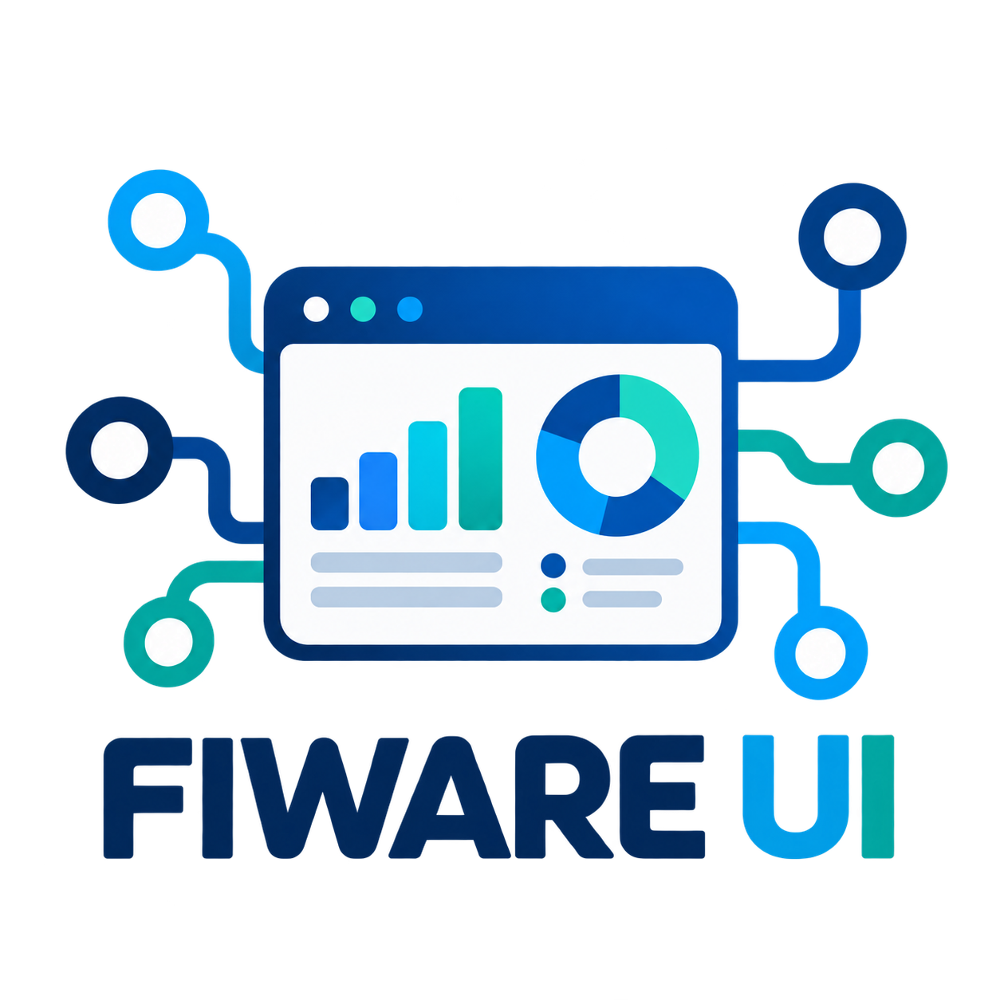
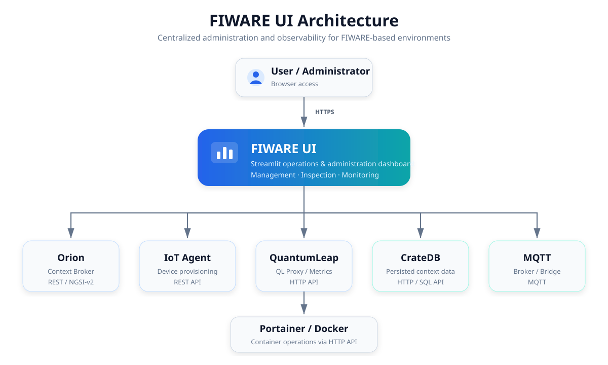

# FIWARE UI

<p align="center">
  
</p>

<p align="center">
  <a href="https://github.com/sKuvent/fiware-ui/actions/workflows/ci.yml">
    
  </a>
  <a href="https://github.com/sKuvent/fiware-ui/releases">
    
  </a>
  <a href="https://github.com/sKuvent/fiware-ui/blob/main/LICENSE">
    
  </a>
  <a href="https://www.python.org/">
    
  </a>
  <a href="https://www.docker.com/">
    
  </a>
</p>

A lightweight **operations and administration dashboard for FIWARE**, built with Streamlit.

FIWARE UI provides a single web interface for common operational tasks across a FIWARE stack, including **Orion Context Broker, IoT Agent, QuantumLeap, CrateDB, MQTT, and Portainer**.

Instead of switching between `curl`, database consoles, monitoring tools, MQTT clients, and container management interfaces, FIWARE UI brings frequently used administration and observability workflows together in one place.

---

## Features

| Area               | Capabilities                                       |
| ------------------ | -------------------------------------------------- |
| **Architecture**   | Visual overview of the connected FIWARE components |
| **Entities**       | Search, inspect, edit, and delete Orion entities   |
| **IoT Agent**      | Inspect and manage service groups                  |
| **Subscriptions**  | View and manage Orion subscriptions                |
| **CrateDB**        | Query and preview persisted FIWARE data            |
| **Metrics**        | Monitor Orion and QuantumLeap Proxy metrics        |
| **Migration**      | Migrate FIWARE service data between environments   |
| **MQTT**           | Monitor MQTT broker and bridge information         |
| **Portainer**      | Access Docker and Portainer-related operations     |
| **Authentication** | Protect dashboard access with authenticated login  |

---

## Why FIWARE UI?

Operating a FIWARE environment often involves several independent tools and APIs:

```text
Orion Context Broker ──┐
IoT Agent ─────────────┤
QuantumLeap ───────────┤
CrateDB ───────────────┼──► FIWARE UI
MQTT ──────────────────┤       │
Portainer / Docker ────┘       ▼
                         One web interface
```

FIWARE UI is designed to simplify these recurring operational tasks without replacing the underlying FIWARE components.

Typical use cases include:

* inspecting entity data without manually creating REST requests
* checking IoT Agent service groups
* managing Orion subscriptions
* querying historical data in CrateDB
* monitoring application and persistence metrics
* inspecting MQTT-related information
* performing controlled service migrations
* accessing operational information from a central dashboard

---

## Architecture

FIWARE UI acts as a centralized administration and observability layer for the
services of a FIWARE-based environment.

<p align="center">
  
</p>

The dashboard communicates with the configured services through their HTTP APIs and MQTT interfaces.

---

## Tech Stack

* **Python 3.13+**
* **Streamlit**
* **streamlit-authenticator**
* **requests**
* **pandas**
* **matplotlib**
* **Graphviz**
* **paho-mqtt**
* **uv** for Python and dependency management
* **Docker** for containerized deployment

---

## Prerequisites

Before running FIWARE UI, make sure you have:

* Python 3.13 or newer
* `uv`
* access to the FIWARE services you want to manage
* valid dashboard authentication secrets

Docker is optional and only required for containerized deployment.

---

## Quick Start

### 1. Clone the repository

```bash
git clone https://github.com/sKuvent/fiware-ui.git
cd fiware-ui
```

### 2. Install Python

The project requires Python 3.13 or newer.

Using `uv`:

```bash
uv python install 3.13
```

### 3. Install dependencies

```bash
uv sync --locked
```

This creates a local `.venv` and installs the dependency versions defined in `uv.lock`.

### 4. Configure the environment

Copy the example configuration:

```bash
cp .env.example .env
```

Edit `.env` and configure authentication and FIWARE service endpoints.

### 5. Load the environment

On Linux or macOS:

```bash
set -a
source .env
set +a
```

### 6. Start FIWARE UI

```bash
uv run streamlit run fiware_ui.py \
  --server.port=8501 \
  --server.address=0.0.0.0
```

Then open:

```text
http://localhost:8501
```

---

## Configuration

FIWARE UI is configured through environment variables.

### Authentication

| Variable                        | Description                                            |
| ------------------------------- | ------------------------------------------------------ |
| `DASHBOARD_ADMIN_PASSWORD_HASH` | bcrypt password hash used for dashboard authentication |
| `DASHBOARD_COOKIE_KEY`          | Secret key used for authentication cookies             |
| `DASHBOARD_ADMIN_EMAIL`         | Administrator email address                            |

Example:

```env
DASHBOARD_ADMIN_PASSWORD_HASH=<bcrypt-hash>
DASHBOARD_COOKIE_KEY=<long-random-secret>
DASHBOARD_ADMIN_EMAIL=admin@example.com
```

Generate a bcrypt password hash:

```bash
uv run python - <<'PY'
import bcrypt
import getpass

password = getpass.getpass("Admin password: ")
print(bcrypt.hashpw(password.encode(), bcrypt.gensalt()).decode())
PY
```

Generate a random cookie secret:

```bash
python3 -c "import secrets; print(secrets.token_urlsafe(48))"
```

Then add both values to .env:

```bash
DASHBOARD_ADMIN_PASSWORD_HASH='$2b$12$...'
DASHBOARD_COOKIE_KEY='...'
DASHBOARD_ADMIN_EMAIL=admin@example.com
```

### FIWARE Services

| Variable          | Default example         | Description                   |
| ----------------- | ----------------------- | ----------------------------- |
| `ORION_URL`       | `http://localhost:1026` | Orion Context Broker endpoint |
| `IOTA_URL`        | `http://localhost:4041` | IoT Agent endpoint            |
| `CRATE_URL`       | `http://localhost:4200` | CrateDB endpoint              |
| `MQTT_BROKER_URL` | `mqtt://localhost:1883` | MQTT broker                   |
| `QL_PROXY_URL`    | `http://localhost:8080` | QuantumLeap Proxy endpoint    |
| `PORTAINER_URL`   | `http://localhost:9000` | Portainer endpoint            |

### FIWARE Tenant

| Variable             | Default example | Description                     |
| -------------------- | --------------- | ------------------------------- |
| `FIWARE_SERVICE`     | `smartenergy`   | FIWARE service / tenant         |
| `FIWARE_SERVICEPATH` | `/`             | FIWARE service path             |
| `REQUEST_TIMEOUT`    | `20`            | HTTP request timeout in seconds |

Example:

```env
ORION_URL=http://localhost:1026
IOTA_URL=http://localhost:4041
CRATE_URL=http://localhost:4200
MQTT_BROKER_URL=mqtt://localhost:1883
QL_PROXY_URL=http://localhost:8080
PORTAINER_URL=http://localhost:9000

FIWARE_SERVICE=smartenergy
FIWARE_SERVICEPATH=/
REQUEST_TIMEOUT=20
```

---

## Docker

A Dockerfile is included for containerized deployment.

### Build

```bash
docker build -t fiware-ui .
```

### Run

```bash
docker run \
  --env-file .env \
  --publish 8501:8501 \
  fiware-ui
```

The container exposes port `8501` and includes a Streamlit health check.

The image runs the application as a non-root user.

---

## Project Structure

```text
fiware-ui/
├── fiware_ui.py
├── fiware_tool.py
├── pyproject.toml
├── uv.lock
├── Dockerfile
├── .env.example
├── fiware_logo.png
└── ui/
    ├── tab_architecture.py
    ├── tab_entities.py
    ├── tab_service_groups.py
    ├── tab_subscriptions.py
    ├── tab_migration.py
    ├── tab_cratedb.py
    ├── tab_metrics.py
    ├── tab_portainer.py
    └── tab_info.py
```

### Main Components

`fiware_ui.py`
: Streamlit application entry point and dashboard setup.

`fiware_tool.py`
: Shared FIWARE-related functionality and service communication.

`ui/`
: Individual dashboard views and operational modules.

---

## Dependency Management

The project uses `uv` and a committed lockfile for reproducible installations.

Install the locked environment:

```bash
uv sync --locked
```

Add a dependency:

```bash
uv add <package>
```

Update dependencies:

```bash
uv lock --upgrade
uv sync
```

Verify the lockfile:

```bash
uv lock --check
```

Whenever dependencies change, commit both `pyproject.toml` and `uv.lock`.

Do not commit `.venv`.

---

## Security

FIWARE UI can expose administrative and destructive operations. Treat access to the dashboard accordingly.

Recommended production practices:

* never commit `.env` files or credentials
* never commit `DASHBOARD_ADMIN_PASSWORD_HASH`
* never commit `DASHBOARD_COOKIE_KEY`
* use environment variables or a secrets manager
* restrict network access to trusted users and networks
* place the application behind an HTTPS reverse proxy
* keep Streamlit XSRF protection enabled
* use dedicated service accounts where possible
* use a restricted CrateDB user instead of an unrestricted administrative account
* review entity deletion, migration, and SQL functionality before enabling production access
* limit Portainer permissions to the operations required by the dashboard

---

## Development

Create a dedicated branch:

```bash
git checkout -b feature/<feature-name>
```

Install the locked environment:

```bash
uv sync --locked
```

Start the application:

```bash
uv run streamlit run fiware_ui.py
```

Before committing dependency changes:

```bash
uv lock --check
```

Keep changes focused and update the documentation whenever configuration, functionality, or dependencies change.

---

## License

This project is licensed under the **Apache License 2.0**.

See `LICENSE` for details.

---

## Disclaimer

FIWARE UI is an independent administration dashboard for FIWARE-based environments.

Operations such as entity deletion, database queries, service migration, and container management can modify production systems. Review configuration and permissions carefully before deploying the dashboard in a production environment.
